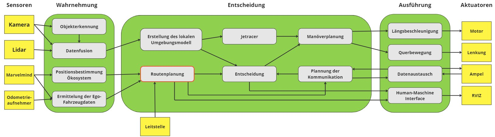
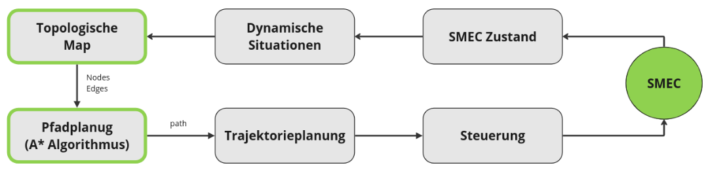
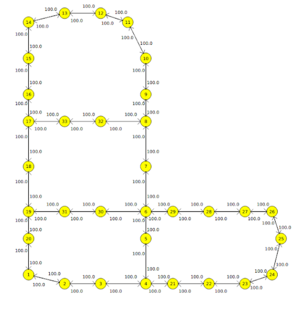
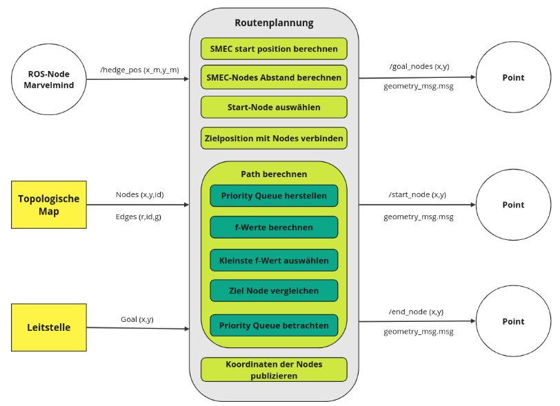
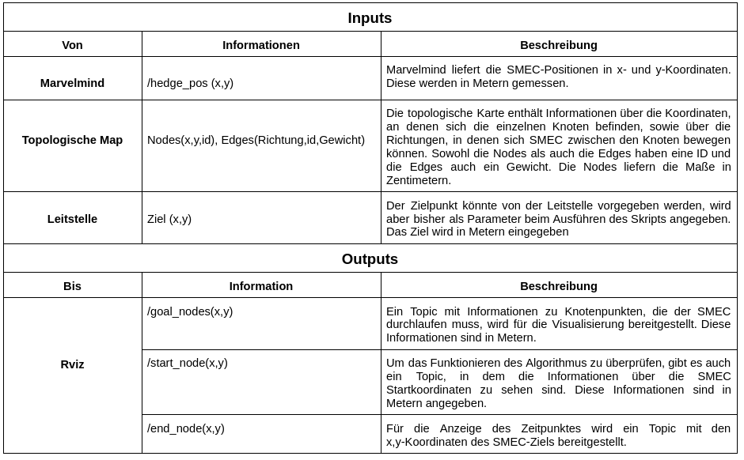

# Komponente Routenplanung

Dieses Repository beschreibt die Komponente Routenplanung, die Teil des SMEC-Systems ist. 

## Einführung

Mit der Implementierung des Routenplans soll die kürzeste Entfernung zwischen zwei Punkten für SMEC ermittelt werden. Im Falle eines autonomen Krankenwagens kann eine gute Routenplanung ein entscheidender Faktor für das rechtzeitige Erreichen des Ziels sein. Der in diesem Repository verwendete Algorithmus ist Algorithmus A* und das Mittel zur Visualisierung des Pfades ist rviz. 

## SMEC-Architektur

Die folgende Abbildung zeigt die für das SMEC-System konzipierte Architektur, wobei ein roter Kasten die Komponente anzeigt, die in diesem Repository implementiert ist.




## Beschreibung der Komponente

Die Routenplanungskomponente ist für die Bestimmung des Path zuständig, den der SMEC von einem Anfangspunkt A zu einem Zielpunkt B in der Modellstadt zurücklegen muss. Die folgende Grafik zeigt in allgemeiner Form, wie das SMEC System die Ausführung der Bewegung vornimmt.



Die grünen Kästen markieren die Schritte, die in dieser Komponente durchgeführt wurden. Damit sich SMEC bewegen kann, wird zunächst eine Karte benötigt, die die Struktur der Straßen beschreibt, aus denen die Modellstadt besteht. In diesem Fall ist die gewählte Karte eine topologische Karte, so dass die Informationen, die sie liefert, auf Knoten und Kanten basieren. Diese Informationen fließen in den Algorithmus ein, der für die Bestimmung des Pfades zuständig ist; für diese Komponente wurde der A*-Algorithmus gewählt.

Es folgt eine kurze Beschreibung der verwendeten Karte sowie des Algorithmus, der zur Ermittlung des Pfades verwendet wird.

### Topologische Map

Für diese Komponente war es erforderlich, eine Karte der Modellstadt zu erstellen, wobei das im folgenden Repository verfügbare Tool verwendet wurde: https://git.hs-coburg.de/Autonomous_Driving/path_planning. Eine Visualisierung der implementierten Karte ist unten abgebildet.



Die Karte setzt sich aus 33 Nodes und 80 Edges zusammen. Jeder der Node ist in einem Abstand von ca. 0,5 m zueinander angeordnet. Das bedeutet, dass die Nodes Informationen über ihre x,y-Position haben. Die Edges, die die Nodes verbinden, beschreiben die Richtungen, in denen man sich von einem Knoten zum anderen bewegen kann. Die Werte von 100, die in den Edges zu sehen sind, stellen die Gewichtung der einzelnen Edges dar. Dieser Wert wurde gewählt, weil jeder Node ungefähr gleich weit voneinander entfernt ist und wir davon ausgehen, dass die Straßen in der Modellstadt für den Verkehr frei sind.

Im Folgenden wird der Algorithmus zur Bestimmung des SMEC-Pfads kurz beschrieben.

### Pfadplanung A* Algorithmus

Für die Routenplanungskomponente wurde der A*-Algorithmus gewählt, um den SMEC-Pfad zu berechnen. Ziel dieses Algorithmus ist es, den kürzesten Weg zu ermitteln, den der SMEC von Punkt A nach Punkt B nehmen sollte. Damit der Algorithmus mit der Berechnung des Path beginnen kann, werden der Startpunkt und der Endpunkt des Path festgelegt. Sobald der Startknoten identifiziert ist, tritt er in eine Warteschlange ein. Alle Nodes, die Teil dieser Warteschlange sind, haben einen Wert f. Dieser Wert ist die Summe der Entfernung zwischen dem zu analysierenden Knoten und dem Startknoten (g) und einer geschätzten Entfernung zum Endknoten h (f=g+h).

Der f-Wert ist der Wert, der bestimmt, welcher Nodes die Warteschlange verlassen wird. Es wird der kleinste f-Wert gewählt, d.h. derjenige mit dem geringsten Abstand. Sobald der Nodes ausgewählt ist, wird der nächste Node in der Warteschlange auf dieselbe Weise analysiert. Dies wird so lange wiederholt, bis die Warteschlange leer ist oder der letzte Node bearbeitet wurde. Um sich ein Bild von der Funktionsweise des Algorithmus zu machen, empfiehlt es sich, diese Seite zu besuchen: https://algorithms.discrete.ma.tum.de/graph-algorithms/spp-a-star/index_de.html 

Dieser Algorithmus ist bereits in dem folgenden Repository implementiert:  https://git.hs-coburg.de/Autonomous_Driving/path_planning. Dabei wurde der bereits implementierte Algorithmus mit der SMEC-Routenplanung Komponente gekoppelt. Darüber hinaus wurden verschiedene Funktionen implementiert, um die Komponente zu vervollständigen. Dies ist in der folgenden Abbildung zu sehen.



Auf der linken Seite des Diagramms sind die Eingänge der Komponente und auf der rechten Seite die Ausgänge des Systems dargestellt. Wie bereits erwähnt, ist einer der wichtigsten Inputs die Information, die aus der erstellten Topologiekarte stammt. Eine weitere Eingabe für die Komponente ist das Ziel, zu dem der SMEC gehen soll, dies kann zum Beispiel von der Leitstelle geliefert werden.

Da sich SMEC zum Zeitpunkt des Entstehens an einem beliebigen Ort befinden kann und für die Anwendung des A*-Algorithmus der Ursprungspunkt benötigt wird, ist es notwendig, diese Koordinate zu bestimmen. Zu diesem Zweck werden die vom Marvelmind-Positionierungssystem bereitgestellten Informationen verwendet.

Der mittlere Teil der Grafik beschreibt die in der Komponente implementierten Funktionen. Diese Funktionen werden im Abschnitt Planung und Umsetzung ausführlicher beschrieben. Für die Ausgänge und nach den für dieses Modul erhaltenen Kriterien wurde festgelegt, dass die Ausgänge der Routenplanungskomponente Topic sind, die Informationen mit den Koordinaten der Nodes liefern, die SMEC anfahren muss, den Startknoten und den Zielknoten.

## Beschreibung der Schnittstellen

Die folgende Tabelle zeigt die Schnittstellen, über die diese Komponente verfügt.



Für die Schnittstelle zu rviz wurden Nachrichten im Format geometry_std gewählt. Diese haben einen Nachrichtentyp namens Point, der den Austausch von x,y,z-Koordinateninformationen ermöglicht. In diesem Fall wurden nur die x,y-Koordinaten verwendet.

Für das Modul 6 Use Case wurden zwei Output-Signale hinzugefügt, die der Kommunikation mit der Entscheidungskomponente dienen:

- /goal: Dieses Signal zeigt an, wann das SMEC den Zielpunkt erreicht hat.
- /intersection_over: Dieses Signal wird auf True gesetzt, sobald das SMEC die erste Kreuzung überquert hat.

## Planung und Umsetzung

 In diesem Abschnitt möchte ich den Plan erläutern und die für diese Komponente getroffenen Entscheidungen erklären. Damit der A*-Algorithmus korrekt funktioniert, müssen der Startknoten und der Zielknoten eingegeben werden. Damit zeigt der Algorithmus die IDs der Knoten an, die durchquert werden müssen und die die kürzeste Entfernung zwischen den beiden Punkten beschreiben. Der erste Schritt in dieser Implementierung ist die Bestimmung des Startknotens. Um die Ungenauigkeiten von marvelmind zu verbessern, wurden die ersten zehn Werte sowohl für die x-Koordinaten als auch für die y-Koordinaten gesammelt und der Durchschnittswert für beide Koordinaten berechnet. Nach der Ermittlung des Startpunktes war es notwendig, diese Information mit jedem verfügbaren Knoten in der Topologie der Modellstadt abzugleichen. Dies ist notwendig, da die SMEC nicht immer genau auf einem Knotenpunkt liegen werden. 
 
 Nach dem Abgleich der SMEC-Startpunktinformationen mit einem Knoten in der Karte musste der Zielknoten bestimmt werden. Es wurde beschlossen, dies mit Hilfe von ROS-Argumenten zu tun, d.h. bei der Ausführung des Pakets müssen die Koordinaten des Zielpunkts eingegeben werden. In gleicher Weise muss diese Information mit einem Kartenknoten abgeglichen werden, hier wird die gleiche Suche durchgeführt wie beim Startknoten.
 
 Die Kartenknoten sind in einem Abstand von ca. 1m zueinander angeordnet, an dieser Stelle ist es notwendig, die gewünschte Genauigkeit bei der Darstellung des Pfades im Visualisierungssystem zu berücksichtigen. Angenommen, der Zielpunkt befindet sich genau in der Mitte zwischen zwei Knoten. Mit dem in diesem Repository angewandten Algorithmus wird dieser Punkt dem Knoten zugeordnet, der näher an dem Punkt liegt, d. h. der Punkt befindet sich in einem Abstand von etwa 0,5 m. Wenn der Abstand zwischen den Knoten größer ist, wird auch dieser Fehler größer. Ich denke, dass ein Fehler von 0,5 m für die Modellstadt tolerierbar ist. Wenn eine höhere Genauigkeit gewünscht ist, sollte der Abstand zwischen den Knoten verringert werden.
 
 Wie gesagt, die Ausgabe des A*-Algorithmus ist eine Folge von Knotennummern, die der SMEC durchfahren muss. Mit dieser Ausgabe wurden die erhaltenen IDs mit den IDs der Knoten in der Karte abgeglichen und die Koordinaten extrahiert. Denn für die Visualisierung ist es notwendig, die Werte von x, y und in den Markern einzugeben. 

## Requirements

Nachfolgend finden Sie eine Beschreibung der Pakete, die für das ordnungsgemäße Funktionieren dieser Komponente erforderlich sind.

Das marvelmind repository ermöglicht die Kommunikation zwischen dem marvelmind positioning system und ros.

- Marvelmind: https://git.hs-coburg.de/Autonomous_Driving/ros_marvelmind_package.git

Das Paket, das es erlaubt, die Karte der Modellstadt in rviz zu visualisieren

- Modellstadt in rviz: https://git.hs-coburg.de/SMEC/map_und_pos.git

Das folgende Paket ist für die Verbindung mit rviz verfügbar. 

- Markers: https://git.hs-coburg.de/SMEC/marker_path

Nachdem Sie die oben genannten Repositories geklont und die in den einzelnen Paketen beschriebenen Schritte ausgeführt haben, sollten Sie dieses Repository in den ros-Arbeitsbereich einfügen.

Colcon Build von Ihrem Arbeitsbereich aus durchführen

```
colcon build --symlink-install
```

Dann müssen die folgenden Schritte befolgt werden, damit bei der Ausführung der erstellten Map diese gelesen wird und die verschiedenen bereits implementierten Algorithmen leicht in das für diese Komponente geschriebene Skript importiert werden können.

- Kopieren Sie den Ordner map aus dem Verzeichnis /path_algo in Ihren ros_workspace
- Kopieren Sie alle .py-Dateien aus dem Ordner /path_algo/path_panning in das Verzeichnis ros_workspace/install/smec_path_planning/lib/python3.8/site-packages


Damit die Komponente funktioniert, muss ein von marvelvelmind gelieferter /hedge_pos-Knoten bereits existieren.
 
Nachdem die oben genannten Schritte durchgeführt wurden, führen Sie den folgenden Befehl aus. Die Werte ziel_x und ziel_y können frei gewählt werden. Denken Sie aber daran, dass es sich um die Zielkoordinaten von SMEC in Bezug auf die Modellstadt handelt.

```
ros2 run smec_path_planning pathpl --ros-args -p ziel_x:=8.0 -p ziel_y:=3.0
```

Um den berechneten Pfad zu sehen, muss der folgende Befehl ausgeführt werden.

```
ros2 run marker_path mgoal
```

Öffnen Sie dann rviz und fügen Sie die erstellten Marker als Topic hinzu. Der berechnete Pfad und eine Flagge für den Zielpunkt sollten angezeigt werden, wie oben gezeigt.


